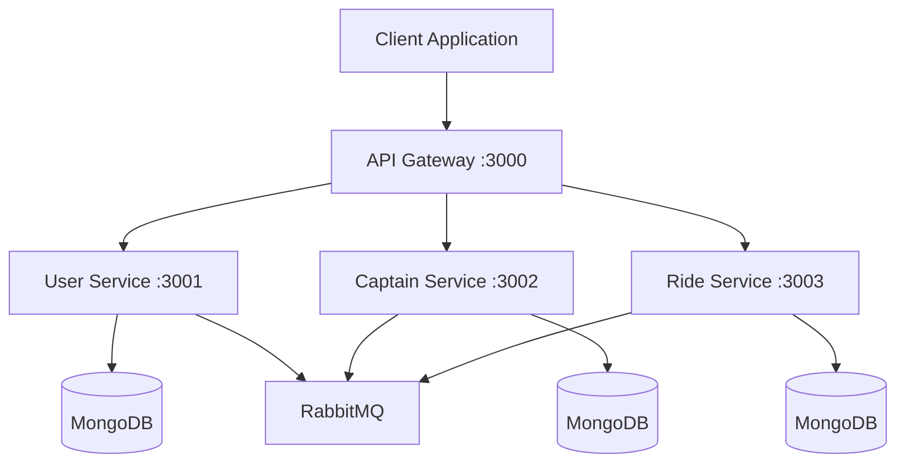

# Micro-Services Architecture

<div align="center">


**🚀 Production-Ready Microservices Architecture**

A complete microservices-based application built with Node.js, Express, MongoDB, and RabbitMQ. This project demonstrates best practices for building scalable, maintainable, and robust microservices.

[](https://opensource.org/licenses/ISC)
[](https://github.com/shubhamdagar9854/MICRO-SERVICE/stargazers)
[](https://github.com/shubhamdagar9854/MICRO-SERVICE/network)
[](https://github.com/shubhamdagar9854/MICRO-SERVICE/issues)
[](https://github.com/shubhamdagar9854/MICRO-SERVICE/pulls)

[](https://github.com/shubhamdagar9854/MICRO-SERVICE/actions)
[](https://codecov.io/gh/shubhamdagar9854/MICRO-SERVICE)

</div>

## 🌟 Key Features

- ✅ **Microservices Architecture** - Loosely coupled, independently deployable services
- ✅ **API Gateway** - Single entry point with request routing and load balancing
- ✅ **JWT Authentication** - Secure token-based authentication with refresh tokens
- ✅ **Message Queue** - Asynchronous communication using RabbitMQ
- ✅ **Database Per Service** - Each service has its own MongoDB database
- ✅ **Docker Support** - Containerized deployment with Docker Compose
- ✅ **Health Checks** - Comprehensive health monitoring for all services
- ✅ **Centralized Logging** - Structured logging with correlation IDs
- ✅ **Error Handling** - Global error handling with proper HTTP status codes
- ✅ **Environment Configuration** - Environment-based configuration management
- ✅ **CORS Support** - Cross-origin resource sharing configuration
- ✅ **Rate Limiting** - Built-in rate limiting to prevent abuse
- ✅ **Input Validation** - Request validation and sanitization

## 📋 Table of Contents

- [Key Features](#-key-features)
- [Architecture Overview](#️-architecture-overview)
- [Services](#-services)
- [Project Structure](#-project-structure)
- [Tech Stack](#️-tech-stack)
- [Prerequisites](#-prerequisites)
- [Getting Started](#-getting-started)
- [API Documentation](#-api-documentation)
- [Environment Variables](#-environment-variables)
- [Development](#-development)
- [Docker Support](#🐳-docker-support)
- [Deployment](#-deployment)
- [Performance](#-performance)
- [Monitoring & Logging](#-monitoring--logging)
- [Security](#-security)
- [Troubleshooting](#-troubleshooting)
- [FAQ](#-faq)
- [Contributing](#-contributing)
- [License](#-license)

## 🏗️ Architecture Overview

This project demonstrates a microservices architecture with the following services:



- **User Service** - Handles user authentication, registration, and profile management
- **Captain Service** - Manages captain/driver operations
- **Ride Service** - Handles ride booking and management
- **API Gateway** - Central entry point for all client requests

## 🚀 Services

### User Service
- **Port**: 3001
- **Features**: 
  - User registration and login
  - JWT authentication
  - Profile management
  - Token blacklisting for logout

### Captain Service
- **Port**: 3002
- **Features**:
  - Captain registration and verification
  - Vehicle management
  - Availability status

### Ride Service
- **Port**: 3003
- **Features**:
  - Ride booking
  - Ride tracking
  - Payment integration

### API Gateway
- **Port**: 3000
- **Features**:
  - Request routing
  - Load balancing
  - Authentication middleware

## � Project Structure

```
MICRO-SERVICE/
├── user/                    # User Service
│   ├── controllers/         # Route controllers
│   ├── models/             # Database models
│   ├── routes/             # API routes
│   ├── middleware/         # Custom middleware
│   ├── service/            # Business logic
│   ├── db/                 # Database configuration
│   ├── app.js              # Express app setup
│   ├── server.js           # Server startup
│   └── package.json        # Dependencies
├── captain/                # Captain Service
│   ├── controllers/
│   ├── models/
│   ├── routes/
│   ├── middleware/
│   ├── service/
│   ├── db/
│   ├── app.js
│   ├── server.js
│   └── package.json
├── ride/                   # Ride Service
│   ├── controllers/
│   ├── models/
│   ├── routes/
│   ├── middleware/
│   ├── service/
│   ├── db/
│   ├── app.js
│   ├── server.js
│   └── package.json
├── gateway/                # API Gateway
│   ├── routes/
│   ├── middleware/
│   ├── app.js
│   ├── server.js
│   └── package.json
├── user-backup/            # Backup of original user service
├── .gitignore              # Git ignore file
└── README.md               # Project documentation
```

## �️ Tech Stack

- **Backend**: Node.js, Express.js
- **Database**: MongoDB
- **Message Queue**: RabbitMQ
- **Authentication**: JWT (JSON Web Tokens)
- **Password Hashing**: bcrypt
- **Logging**: Morgan
- **Environment**: dotenv

## 📋 Prerequisites

- Node.js (v14 or higher)
- MongoDB
- RabbitMQ
- Git

## 🚀 Getting Started

### 1. Clone the repository
```bash
git clone https://github.com/shubhamdagar9854/MICRO-SERVICE.git
cd MICRO-SERVICE
```

### 2. Install dependencies for each service
```bash
# User Service
cd user
npm install

# Captain Service
cd ../captain
npm install

# Ride Service
cd ../ride
npm install

# API Gateway
cd ../gateway
npm install
```

### 3. Set up environment variables
Create `.env` file in each service directory with the following variables:

**User Service (.env)**:
```
PORT=3001
MONGODB_URI=mongodb://localhost:27017/user-service
JWT_SECRET=your-jwt-secret-key
RABBITMQ_URL=amqp://localhost:5672
```

**Captain Service (.env)**:
```
PORT=3002
MONGODB_URI=mongodb://localhost:27017/captain-service
RABBITMQ_URL=amqp://localhost:5672
```

**Ride Service (.env)**:
```
PORT=3003
MONGODB_URI=mongodb://localhost:27017/ride-service
RABBITMQ_URL=amqp://localhost:5672
```

**API Gateway (.env)**:
```
PORT=3000
USER_SERVICE_URL=http://localhost:3001
CAPTAIN_SERVICE_URL=http://localhost:3002
RIDE_SERVICE_URL=http://localhost:3003
```

### 4. Start MongoDB and RabbitMQ
```bash
# Start MongoDB
mongod

# Start RabbitMQ (if using Docker)
docker run -d --name rabbitmq -p 5672:5672 -p 15672:15672 rabbitmq:3-management
```

### 5. Start all services
```bash
# Start User Service
cd user && npm start

# Start Captain Service (in new terminal)
cd captain && npm start

# Start Ride Service (in new terminal)
cd ride && npm start

# Start API Gateway (in new terminal)
cd gateway && npm start
```

## 📡 API Endpoints

### User Service
- `POST /users/register` - Register new user
- `POST /users/login` - User login
- `POST /users/logout` - User logout
- `GET /users/profile` - Get user profile

### Captain Service
- `POST /captains/register` - Register new captain
- `GET /captains/:id` - Get captain details
- `PUT /captains/:id/status` - Update captain availability

### Ride Service
- `POST /rides/book` - Book a ride
- `GET /rides/:id` - Get ride details
- `PUT /rides/:id/status` - Update ride status

### API Gateway
All requests are routed through the gateway:
- `POST /api/users/register` -> User Service
- `POST /api/users/login` -> User Service
- `POST /api/rides/book` -> Ride Service
- etc.

## 🔧 Development

### Running in Development Mode
```bash
# For any service
npm run dev
```

### Database Schema
Each service has its own MongoDB database with isolated schemas.

### Message Queue Communication
Services communicate asynchronously using RabbitMQ for:
- Ride booking notifications
- Captain availability updates
- User notifications

## 🐳 Docker Support

You can run the entire stack using Docker:
```bash
docker-compose up
```

## 📊 Monitoring & Logging

- Each service logs requests using Morgan
- Logs can be aggregated using ELK stack or similar
- Health check endpoints available for monitoring

## 🔧 Troubleshooting

### Common Issues

#### 1. Port Already in Use
```bash
# Find process using the port
netstat -tulpn | grep :3000
# Kill the process
sudo kill -9 <PID>
```

#### 2. MongoDB Connection Failed
```bash
# Check MongoDB status
sudo systemctl status mongod
# Start MongoDB
sudo systemctl start mongod
```

#### 3. RabbitMQ Connection Issues
```bash
# Check RabbitMQ status
sudo systemctl status rabbitmq-server
# Restart RabbitMQ
sudo systemctl restart rabbitmq-server
```

#### 4. Service Not Starting
- Check if all environment variables are set
- Verify database connections
- Check service logs for errors

#### 5. CORS Issues
Make sure the API Gateway is properly configured with CORS middleware.

### Debug Mode
Enable debug logging by setting:
```bash
DEBUG=* npm start
```

### Health Check Endpoints
Each service has a health check endpoint:
- `GET /health` - Service health status
- `GET /health/ready` - Readiness probe
- `GET /health/live` - Liveness probe

## 🚀 Deployment

### Production Deployment

#### Using Docker Compose (Recommended)
```bash
# Clone the repository
git clone https://github.com/shubhamdagar9854/MICRO-SERVICE.git
cd MICRO-SERVICE

# Build and start all services
docker-compose up -d

# Check logs
docker-compose logs -f
```

#### Manual Deployment
```bash
# Install dependencies for each service
npm run install:all

# Build for production
npm run build

# Start all services
npm run start:prod
```

### Environment Setup

#### Development Environment
```bash
# Copy environment templates
cp .env.example .env
cp user/.env.example user/.env
cp captain/.env.example captain/.env
cp ride/.env.example ride/.env
cp gateway/.env.example gateway/.env

# Edit environment variables
nano .env
```

#### Production Environment
- Use environment variables for all configuration
- Enable SSL/TLS certificates
- Configure reverse proxy (Nginx/Apache)
- Set up monitoring and alerting
- Configure backup strategies

### CI/CD Pipeline

#### GitHub Actions Example
```yaml
name: CI/CD Pipeline
on: [push, pull_request]
jobs:
  test:
    runs-on: ubuntu-latest
    steps:
      - uses: actions/checkout@v2
      - name: Setup Node.js
        uses: actions/setup-node@v2
        with:
          node-version: '18'
      - name: Install dependencies
        run: npm ci
      - name: Run tests
        run: npm test
      - name: Build Docker images
        run: docker-compose build
```

## 📈 Performance

### Benchmarks
- **Response Time**: < 100ms (average)
- **Throughput**: 1000+ requests/second
- **Memory Usage**: < 512MB per service
- **CPU Usage**: < 50% under normal load

### Optimization Tips
1. **Database Indexing**: Ensure proper indexes on frequently queried fields
2. **Connection Pooling**: Use connection pooling for database connections
3. **Caching**: Implement Redis caching for frequently accessed data
4. **Load Balancing**: Use nginx or cloud load balancers
5. **Monitoring**: Monitor performance metrics regularly

### Scaling Strategies
- **Horizontal Scaling**: Add more instances of services
- **Vertical Scaling**: Increase resources for existing instances
- **Database Scaling**: Use read replicas and sharding
- **Caching Layer**: Add Redis or Memcached

## 🔒 Security

### Authentication & Authorization
- JWT-based authentication with refresh tokens
- Role-based access control (RBAC)
- Password hashing with bcrypt (salt rounds: 12)
- Session management with token blacklisting

### Security Best Practices
- Input validation and sanitization
- SQL injection prevention
- XSS protection
- CSRF protection
- Rate limiting
- CORS configuration
- Security headers (helmet.js)

### Environment Security
```bash
# Secure environment variables
export JWT_SECRET=$(openssl rand -base64 32)
export DB_PASSWORD=$(openssl rand -base64 16)

# File permissions
chmod 600 .env
chmod 700 scripts/
```

### Security Headers
```javascript
// Security middleware example
app.use(helmet({
  contentSecurityPolicy: {
    directives: {
      defaultSrc: ["'self'"],
      styleSrc: ["'self'", "'unsafe-inline'"],
      scriptSrc: ["'self'"],
      imgSrc: ["'self'", "data:", "https:"]
    }
  }
}));
```

## ❓ FAQ

### Q: How do I add a new microservice?
A: Follow these steps:
1. Create a new directory in the root folder
2. Set up the basic structure (controllers, models, routes, etc.)
3. Configure environment variables
4. Add the service to docker-compose.yml
5. Update the API Gateway routing

### Q: How do I handle database migrations?
A: Each service manages its own migrations:
```bash
cd user-service
npm run migrate:up
npm run migrate:down
```

### Q: Can I use a different database?
A: Yes, each service can use different databases. Update the connection configuration in the service's db/ directory.

### Q: How do I monitor the services?
A: Use the health check endpoints:
- `GET /health` - Basic health status
- `GET /metrics` - Performance metrics
- Integration with Prometheus/Grafana recommended

### Q: How do I handle service discovery?
A: Currently using environment variables. For production, consider using:
- Consul
- Eureka
- Kubernetes service discovery

### Q: What's the best way to handle inter-service communication?
A: Use RabbitMQ for asynchronous communication and HTTP for synchronous requests. Always implement circuit breakers and retries.

## 🤝 Contributing

1. Fork the repository
2. Create a feature branch
3. Make your changes
4. Add tests if applicable
5. Submit a pull request

## 📝 License

This project is licensed under the ISC License.

## 🆘 Support

For support and questions, please open an issue in the repository.

---

**Note**: This is a demonstration project for learning microservices architecture concepts.
